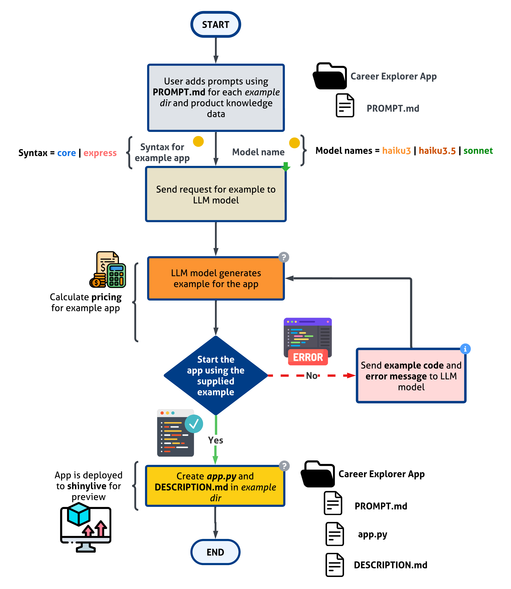
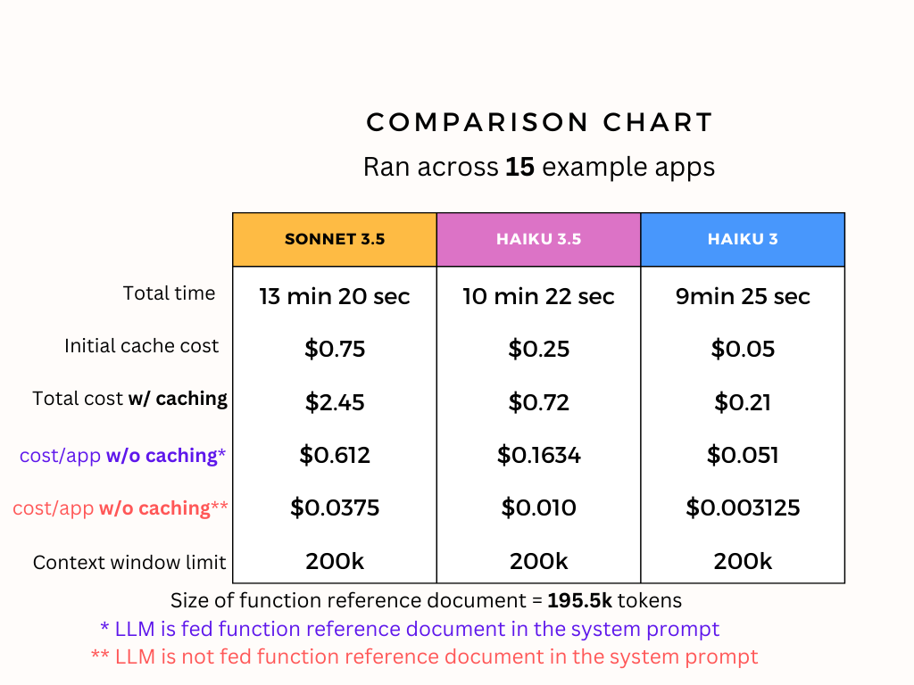

# pyshiny_examples
Repo that creates py-shiny examples for the given prompt leveraging AI


## How it works



## Why use product knowledge data or function reference document in system prompt for the LLM?

Older versions of large language models (LLMs) may not be aware of certain components or the best way to leverage certain shiny components. This could be due to their knowledge cutoff date or simply not being trained on Shiny documentation.

By providing the LLM with the product knowledge data or function reference document, the LLM can generate more accurate and relevant code snippets for the given prompt. This will help the LLM to generate code snippets that are more relevant and useful for the given prompt.

As an example:

This is the app generated by the LLM without the latest product knowledge data or function reference document:

```python

app_ui = ui.page_fluid(
    ui.panel_title("Restaurant Management App"),
    ui.tabset(
        ui.tab_panel(
            "Menu Management",
            ...

```
where `ui.tabset` is not a shiny component and the LLM did hallucinate in producing that line of code. The closest to that is `ui.navset_tab`.

Another example:
```python

app_ui = ui.page_fluid(
    ui.panel_title("Spending Habit Analyzer"),
    ui.layout_sidebar(
        ui.sidebar(
            ui.input_date_range("date_range", "Date Range", default=[spending_df['date'].min(), spending_df['date'].max()]),
            ui.input_checkbox_group("categories", "Select Categories", categories, value=categories),
            ui.output_ui("recommendation_container")
        ),
        ...
```
The app throws an error
> TypeError: `input_date_range()` got an unexpected keyword argument 'default'

This is because `input_date_range` does not have a `default` argument. The input_date_range component has the following arguments but the LLM was not aware of it.
```python
ui.input_date_range(
    id,
    label,
    *,
    start=None,
    end=None,
    min=None,
    max=None,
    format='yyyy-mm-dd',
    startview='month',
    weekstart=0,
    language='en',
    separator=' to ',
    width=None,
    autoclose=True,
)
```


## Comparing the Quality of Apps Across Different LLM Models

Given this prompt in the [`PROMPT.md`](careerexplorer/PROMPT.md) file :
> Create an interactive tool to explore career paths, including required skills, education, and experience, as well as potential career progression and salary growth.

Below are the example apps created by each model:

### Haiku 3

[Career Explorer App](https://shinylive.io/py/app/#h=0&code=NobwRAdghgtgpmAXAAjFADugdOgnmAGlQGMB7CAFzkqVQEsZ1SAnC5ZqCAE1JgB0IAM2a9kXKFQoM4yBk1ZiJcKfAHDRFXOjoQA5rMYs2AGToBnCkQAqAV3QAbOAIFyjyGBIekK9ugCMcLXtvZCgzZAcKF0MFCBtGXFDwiHRo+TZ0TnFwsIiuNREYZDMACx1E1wUAQUwiAEkUmwozIgB5JvQmluQAZTgzMzpyImY4KGIpADc4EeouOGZZgEciGzpnCABiXtgHGXEKKGRBFmRiKFGFiIkSswFzy+ZwgF5kEAFkT+Q+MB7SQQoAHcLjIAKJ6HRwBY-FDvCBfBHfMBmADWdHs9jutGAPwACrgKCVyD8iD8AFJQSZQElInoARWMNJ+AHE6FFCEiqrp0U4wABdAgfRGfH5wLg2c5SYnYn4AIXGJTgwWYAHJwjpkABhXidKjMXrEOjUYi80lgACyYT1atk8O1jCaVx6huNvIFQuFooAHugFkaICaYcgcWAGnqIKU6KkOT9wRRmLgALSOab2JkWuhcZNwVPpvoQIbMH7u+HCpFmKD2C64AD6uhEgMJQeAADYAAwdttEAAcna7yAAjH3+wOAEx9ksIgC+gtLIrAABEJEcqtB7LgLEG4WXy2iMViUCH6YyY2BQV6TWnT1YoH5HFAbOn8YTpWaAErF2c70XiyVDCDNnKCpKiwNoaj0hxSBYdDEFiZrysQirKmB8KgmQEC8DBWKTmW3q+sw-qBjKoaUAsEZlNGZpxgm2a5qe5qZrRSp5tQhafh6iI-BWVYJnWDZNtiACsfZEC2wkdj2InIAAnOJbY4Z8M4cT8lrMCiyg6PolrQLo0K0NuuHInumKARaFzqVIei9PGSi6LgeakIalbIOaYp0NSp49KCrTpqulYElh6b2jANgFn+0oKZxYBihKEj-qZCFIaB6rwqpFmaem5qylU7FzlFcA+n6rqmWGZGRpRSLUUmKbMfRjE1VeZr5mx-JfoZ3HVnxpCNiUzYACxyaJUkAOyDTJE5tYps5ThsGDoDWazIK8aw4FAuk1oI9hrFwAAUHErZkEBKjWUg+HAe1gJqIJXLiNzIOeXijEWYAAJSTcgK0NnteUIitZBbTAEA7X1pI-WWK06LqNZmEqcATBdDxQs9TWwxMoRatdyPIL4Fg7YjCxmFg6kbjtL1vcUqNUFwzw-H8ALAqM90QkdelvRxO4Q40FDQ5TF0FfhhGmrSlP3YVBGusgxg5rVRAhqVzDkVG6ZVUxjVIgxWYNSxBYsJ+FOOBMYo02elA0Vrr3vQibNg58f2kADQPdpb4N0FgpAdE0J0FRQF2ouiJkW+zLtux73NUF6Ps-rFUoAYHNuIit7sUFD4eR8ilbVj81s7r9rtJ1DXhpx1vGF1nzufNnXzWy9GzzIIFPMNMzA7ZDTQoA0urdPnbfIO0yddEQMMDP+KB9MP5AvYgHEAAKjOMUxwFg5z2MQHF1-rcNUzW+PNy9yCJgAfGIMEUFP8ejBQNgK2cmNmMArcUEvmOk3yGwIrPcwLFgqdr3A9d+-uUmZ8dwXyvvCH4b44BLDWKMLgvRjJmCngIRMSJkAAGokR8GQUiLAAArUgOgdowwNlvHepMQwAIDnyGuAE8of24F-H+eV14xXCkDSeQdPigOvhAqBMCxT3V-HFcgSCIAoJ+OgzB2Cfh4IIUDYhm8xTb2fi9EMrDhGx2oW-L49D5jMG-t7X+-8M4JiAZw5A-MioBjgDWBqS1bS6iwJY8W1jSbmJ0PML09iFGGy4Mox45C8JWKInyLAHiCo7WcYLWx0t7A0J3MXRIrwfGkJURQkxtZ6zdQEnye+DCvSv3PsoMBxwfhWC0DBZyPQMkoAACQgESYgAgWA2yCBmmAbRnxdFf1Lswv+xQMk1kLmY+OO9vGUyUWQ+JZYomuhiamF4N9HhqLFoLYs5ji5GkWTvdJPFMn8V6vyTpiJBB0F0EQKAXjXiRCwGYGwfhC5mB2qc3QgwABecBng7SdsgFsZNzGXJwMEH2szrHzKVN0TZ-RpnCkBTDbmXoqx+CVBdB6wSZBSzojCxEcLlA1lwEilFtMMnIB2rUmur0AVeluXi06jhnnEr2cgZkBzjinBAA-J+ASXrtOxQibh8IXmzUwPYmo6AdpzQWnQQeCwm4vTADON4kBYAIBQGAUY0C6CjHgJQQmFAI4cjAOhKgNA1UCA8MnYFvg-ACDiAkAQh1sgOqtfZCMYw-AsFoZGCAuBASZl0s0Y5O4FV8iAA)


### Haiku 3.5

[Career Explorer App](https://shinylive.io/py/app/#h=0&code=NobwRAdghgtgpmAXAAjFADugdOgnmAGlQGMB7CAFzkqVQEsZ1SAnC5dKCAEygGdk+7LgB0IDJq2QQAro1wD+EdKPEs2MKBXQAbUhW10ARjlw69C9toorGa5M05dSMUQDNmz5DyoUGcZKqS3nC+8EShcFxwVlBuHjDIvAAWdBDygWwAgphEzHBQxL4AbnC51FHMRNJ0oqIAxMgA4tRwDlSJuJRJIXTEyMRQea3smklemrHccK7IAOYtbXAA+gNDzEscFEm8ABQAlIiiyMf9g3CtG6P8ALzIwEcnjyAPj6-IwmCr58wfKB8AyqRXBQAO5nZAAUQgs1S3w+BBebxOH2oFGYuCW2jgJW0S14AGs6NptLxfncPgAFXBbcjw95gABSUCKUH+xGYdHQ1kI9MadG5RABAEUADIfAC6CIgSNeHxgdC4mOx0TxhOJpNo9zAAGFdNIuMhtc50NJfNC6R8ALIFFIQfwi-LMMTmnkfAAipGI+NaFrAAGlpIZWnaqBrJYiZR9eNQ6CwlTjVUSSWStf9cLwqAlMsxiCkqIVpHlfW7sQB5dAawVgAAqcFzYgG2mQDqgFWSnIlUpljxRXGkA185EuWxTHwAQjboiwAOT8VKG42m4ZsujUYhwX3WjOtWcBaWA4FgvKQ6Gw1qpWadiNIqNQbSDDHoDyzPK8XixiApgDsAFYAAwAUQACMQEAYByBAf+YFEAATGBAHhtK3bHB8FCmL0d4bM+r7vrSmrXshHwMtIYgsMgB6guCUIwnaPqEAR3YAkClHHtRZ4-PRSHIT2YD-DGZEUUe-hsbRHGClx3EoWALYGoJVGnqJ8IMZGNZ1kkDZ3sg2a5vydbcspJzigxAC+XZIs8EkqV8dF-GAboTORxCrpQdAZkplk3mAqLovGKoEkmGooFqVI0p+rq8RQmiub4xCVvSABKvoQgAHuu2hXh5bxygqvm4v56qjmA1o6XazaOs6l7hSWcDoGVgwVb6-yisWDkAGqudId50AAXlFeGIZJUb8esWIJvlyb4WAmRcCyEDrgalpiuFmQAJLkWimhwLMuC+mOdCzMg9mRb68VwNGgy5hlg1eX2A4fsOSSFROuZTswu7zv8kW+BmvS8AA9EajBLswjnOeum58FQb3-RSSRunuh0OSua4bmAA3cbe94+U+pAvmduFhUFAAc8HAXB0EQQAbKTyAweTCFmYRYBoegGG4jjeNvh+o6ZYxjIkbGINHVAWnQNo6YCgZWV2UjTmotF7mSTxfGkULsvOd9ArvLzKkyYjkWg-LbmcUryI6ik0z6yLpauK4vR0VLyBGbzpkMRZ13WRxtkUh4t1sNa0DzGJjsopQPmjX5aoTUFHyAzAAt3XhVYTu+fSZGL1K-b6PukAAVnpyAB1A8zwJQV0Y2A8qKhHeVR4F5IRYsMJ9BS94QA14UAKrRiDp3nTmj3LTCWKFyESSkE4ugwmd5dM9Gqu5YmBWTTnfvrU3O3hWO0jvnab6HcqujoKXWsfCt7ekCyg7SkXJeorPfORP2fUQA9T2Tro0MI9vu-439taXXCpaMcmRs6+37P7Tgxc4An0NK0XwdtE5hXRnPO8D4sK4xwtzTURMoJ-jJng4CX4aYwTwX+FBfMWZswwZzAmPNTZSUyG+T0dBNrIFXhAwuUCg6KwYZScBhQuGBzoozJWAJhrsIEZA4RYltYMPpG6OgeRChkSBJIieEDeGmw+K1CkyA1EcMKB8R2zsZTGURKYk4eQKCFmlJ7B6pJPwQAaM0O0iwOhdB6H0ca-BvCTCiDMeYbjNpLxJEsPxOx7GbG2JiaKBxEQ+PCQ5W4wBLHHFcGRT2CMolXFiRmQ4vMMkg3GrlBGwBpzeQxDXUJvBpxEGnFXRePi6nIFnMNJpddpzigKZJIpiQo7ZLOK0YAJSa7dMdo8RJfisAYHQOUHY7t5EnGnJ7acKBPblNWRQ+Rs4o65TWf0pMuUsB5B0AUOAOxpxLBadOVpewsC+H0BcvYoidnjQOeNCZJxjJ7ERNY2xQgsDCwAGIOHgDsKZExflOJcQsNhvBOhbC8ewbC+MPzjGOlMQJcKqA0KwUOCJOSti8DyRQeJEkOb4tfn45AKS0nID6Vk+cRKYkGHyQxPpdBcikBHvOagshWibUiUM5g5SqGNjxWi8gXTyWSUpVK6lEwZmYHmYs02KyRUHI2RqtYXTXncWnB4LEByjWlC+ccaczJZhLFwI6ElqQlimoOXQZAABqCC+rkKWqKNa3gaD0RapFeUv1WNHyoq5tK8UwB5QQB2Fy5AWJY3apDeg+VEaIAyoALRAT2PSsx0LHj-KdICkFYKLlpoJkkyK0L6iSJquCPxogWUkrZWwW4QTBW4ubfsJtIqHHhJmLcdAXAgUTFBbAC5zbSXQqmYOuYOLliQsisKtY-bW3QorfdLgc6O2LElemqtUAV3fDXXE2ozjyK2nkNkZQ0BMBLGqLS5A1QcDQKWK4bQ1QuA7ERC+jgdpcSPKxD+nUIr2GjEhMlMweQOIvN-XQLA95cCkFNHiBUcBDCDB-bzF974oiYeYNhySL7UgmgoHiaIekiN8LANGLEhRIgrBFRaHWnk+L0bYNqMDFJRgsfkbmUg9teDXCnduzZmrxQPJ5dFHtrHjhwbk8+hDpHUMOC4LGJYhhTQUHILsc19IiirhBEsFmqNxLyJ0UZ5A1ZTBmbkQwgTQnripjrmAzBCrGr+s3nmpEBbfOeqU1gaARRozkdWIqSKhhqPIRfcFy4AGQNcbWAfSKRI4ovpQ1oVD1QQP2KiKliaewFPEYQ3F-90QQPtV4J1AwvVr50gy6aMjGxdAUFy32sw3IisMT8-J0QNasWJFaCUQjKmKBEEy2Rog0Z02ypOAAATyAUYocAsCNmIIiAJQ2OOMbyxMfYPSkRFrsR13JYnROuHE7q8UtLbhjawHRvSu2RX7Ek0ST0wByHnseIt8orQsDVE25bPLIQoBpYOwxLJtxHsMcVHt5dvXZS83y2DsJSQKAwCbLcVwxiwDGN5gAHnU0Ufo943zXB1VwTNhgJ64GnAAPkdgTpIAAWenIBtVbOMoabjowCd-VZ4zxTTOkg-npxCW6L9wNbEQPz0XQvJIE+kNoBXDDnh47AFgXOgnY047AATgw7On7GX54bj4DKyJP0GWscpT8kEPRleYxT-Pleq8Is7+X-w67qNoR+WXAuxci8puLsO8gHQ4nInXf3SRg9M-QOz30WudfHuGRU0PHSAqO-5-HkOHvg+WgVGVCPXuArR9j87+P6uqxJ9SCn0VDScrVOaeKPYJu-o5+F3n+nKtBZF+iJH0vcvy+K8r4n7Xtfk3tKb50lvbeO+DQ92LmzrNGw8+SznX35Bo+B+d67-T6uPg191x8A3dB2emrb2bsAFuQamut98MV6EJWbsja3pnf09+E7+sTt3soNf45lGO0CwAAlqxFodgUc0slh0dMcBsfs8gphmAcBWsgcZgolWsIdeZ7FoB4An17sYcqA4cXtEdHhDM4BjNTM8ClBTQsAyCKDbNZNIxeYdAKAsA7ZZhCwLl2D3xuo4BrgdhQIiBKZuteYGI6AZg6CTNbNbt6QS9l5DtkJ7EfEn1Z0Rk64B0rtvgukZDsCJ0fM3gSkyASIKAbhThV0fEsAXwUN0BDBcBLlRlD5pw9hg0o4uk1sUNKBGDuJDCPCTDkC9AdhCRuAKcCMWkyBP4KcCRcBDBP04AnDHYWCHl+RgM9c5CSRDpooOQtNr4b9kAOc+0cC4BzEwASCkREjkp7wgxtAQM0i+90oSiEirAsBcBKiKsPgAA5WQIMEGNRNIjUUolCXmaIcQ5ASQyg64W4fhdzdNX4R2KJcNAmJ9F-alS7ZYjQnVLQm7CYswk9Qo-Q14RIzrOvfdAmcpJ1SUHYi4ZY8pK1G1O1JYB1c4ogDQZgb0ZgCnUgeIxTRIoDLg2ObjBYv3ZAAATTtQRnih5X8D6XyNXUKOKIGIOKaIqKgCqJAwhKxA+ARMeESJaJRLaKmhG2gRBLtUxMaNYOShinxF2A8C+g-GuBZx-CICSCgApw5FmHRy+KYJlGGIkKMykLmRkIBC81mMU3mOmMWKHUBIJVWKlJWM0J3C2NuF0PgH2OxKaKOLFM3wgDOMhL1UuPWGuO9V9S8z1JeLeI+M5O4h+OSL+N4i8x9ypVyJhN2InXhLJKwGRNRI+HRNRixJOBxNaOqI+EyEJPmHIntJ2AABJfkGjvikTKTqS9AX56TGTkBmTWT9oOSESGJrT2TyMkNMsvC3ggDEjZhiBXBZNRBZkn0b0dhZkH140e4Rs9gwBTI8jIAJ1aAwA8gABHaoPIE+XgB5CknkT4cgKgGgFAPHCADQLQVrAwQwUQGQOQUQf9HgRxTrcWUQc6GnJ0bcq9EEBUeYEw77biVs8UIAA)


### Sonnet

[Career Explorer App](https://shinylive.io/py/app/#h=0&code=NobwRAdghgtgpmAXAAjFADugdOgnmAGlQGMB7CAFzkqVQDMAnUmZAZwAsBLCXZTmdKQYVkAQUxEG1ACZwGRAK6dJcKMQqcAbnAA6EfoOHJ0UCNKitkF49L0GhI9ABtSFJ7ixwAHuimtL1uheeozMbFw8AO6c0gDmcBSW9kakChToaQD60XEJKmZy2THxFHp6AMTIAMJSUFRsuJTsCZzEyOYUUHrEUFKFJhTslgC8NlgAInVQAGIMsHAAFCB6yKvIOmBMTrq0wCtrBxsAUgr6QsjjcNou6HIbRBsAytSc55fXpLcM9+tgACpwYjsZAAGVUtkIv0epDoFEivTgYgYQM4VHU932B1Wx1OrwYFymyEexE41A0rFKkKeLzehOJpMonApPw2k06RJJ1GIiIAsqYoPFvlSwFUuHA6AT2QB5Oh0Vp3QiYrE4s74gAKPJZYGequQGq1aqYsTmLD50EFWvGnCk6nOML1TGkCnRYCVAF0CEqNhQ5sQANYbFB7CBYtZPGFwhEXK5wG7wSha6Gw+FSaMfdDxykPbURlOI96xz6ZxO5qMFuNkjEh0O-NlQDkM7mWumciBN4V1htcnbZzv07tVmu-Q2kJ3qZBmgVwYvCkdjkST+Iz7Nz50L-lLyuzx1ricb6db92e6vYsDba6B5DAACMRAATEQAMxEAAsRFvyAfyGfyDfyA-X4-i+HpemAMDcJk3hfI2OxBgADE+RAAKxEAAHEQCHfshaEYYhyAocgqEgSevwAEYWHAmSsFATi9Lgl7BkOADsSFwWx77Xmx7H-qxXHvqhXEIUqBwCXx-53oJ74AGySf+ACcknCWsTGyZxqkvqpKlce6egAL4AJRlBAUgAI5KFI0hUX6nBOE4IzIMsJHhsmZYxhWCa7Epp5qrggzkFqRxQJoXTCoFwXEgwnDoFmvwAOKoomACKIKJrgFLTtGrCcLEECDjWGxVC4CjSHqtEUHQQgwKwWqiLENm8gk7CjqQLh1XA1XClUACSAD0VTjCWLmpqIyJcGiFAKFIGxHqBfatu2QZecOvlNblwoAEpJSlwp8iiECImCvT6BAsSJp05IaMQHW9oSABqTIKDRnAAF51K8a3HkOGwAELZZKIW9nAcDoKCqgMMdp0doSPLcNwkPZt9ChZft-jIF1lCxk42UDq6JHEYcYCruOi4Hh5i0kQTtX1VqACqrByESFBCKS12-HyDB+gkyDre1YNAmdcxULE9HCqI0DuJd11LU8nSc01TiyPiJPLr862kFA0gwBg6BwzVPXfcgAIUrrwp0wzPP070-PCojyPtZYYs0WlTLTXjelGXAY5veQmSmcgoyOQTSaRqm5ZFlu5NfWA31qM0LgMAA5EkIZVMwGRUPi-Ztj20vR7HhaJ8nRKlqmACiJ3cEDkUnXloYbDzZWe4bgLsPoPRONGxpA67Bz42GYBzTBDG53y6WF3wIaDzjn35WAo8Z0nE+M29xtXbXyqE+w4xL1IjclXKsYQjNTmEzuxP7jOkezzHQIF4v3DILblf+OvBM33HQj3ynadpAzWftjPOuc9vqiGQAsXw4o5AWUMrjXu7tcrQEwJkJQ-tkBKBwFOTIdAnBKGkAsJU6CTD7ScJkDQbhFgFQRAzNUdRgSlx8PHBU+lAHrBIug2iuBUgUCojEOA5EGD4IpmsdBWVZD8MEUOA46DuDpyorGQEFAJGSKAT0PoDBSG+gDIqIRyjqTbHHFUKh+I-iaNfso5AQJSDylYMMLGFIFiqKrpkAYQw9hgB9GoLRbosC4jMosfShkdFYmYUtKRnAsAyKyKwLGislHmP7lBOQQ9tHxIJgATTBpYe09DoLT1CTWcCEBhhCSCUOLWXhhjXhQvk0MwUcFwGKTU5AITSlrByIMYYd5WJLRaV9IJ7CoCcKyGQHBMAIDZDmOgOJkj0F1IUJRUipAvDTPiQVSaUhKDIFLljOqpFtjcxajnVpoZ0FcNkVQLwiiNixmypwPZlEtg7F6ak1YgwDzDA2L4fgdEe7mOeco2ZNF5mZEWcsppBMckKKbjHemRIaI-JSS8tB4SzlZAuVcsAiT1CeyovChgIt-mpLefAD5YBWDOm5C-WBfyWFDnaewSpPU7w9NpWGfp4TVF4KaegzlmRmgazkPgkURiHSkC7v4d6GxCVDlRdwnIJQhWOP6C4SkgShzSrZUOAZQzuEjIUGMiZGAVk1h5b0LlxysSmoYJZflsT65wDMtaJujxrK2Q6hqgFKK0iyKUEK1grq7KZDsaqppHrLUcrNcaz1WBeW2sFRsUuXsNDkG5g68ypNEhStZdG2VyDOBCs9s6b24zg1StDdmrE9LGXMqCWqtYgTAl6FkBKemDBtACMiRQIgsqiD0wleQfSiAvQkQAAK1HUFoOAMaaLECVM25AconAZxxR0KACxB1LSkBNcGFijHONoawYASr1EuMPd6UxYA3T+1GJ26daiNGePXW6YdBwx2qAndoadThZ0kXncQdZZIg1uXXUOoJ0gJSjEXcuyyq711LUSZFbsqDb0IZgnBoJNzdnbF9oc+y4HgD4Y2IUyCPgkk4yvQAHlGKh7sz6gmcAlNsCACxMN3Ow481g+lkAAD5kBwVA-Erdk0QysfuTh7YrAIkuGIMAAAtNeOjQ4hM7oAHLkF0E5UdGzFZYHRXO8UyBRPscOSBpa55YyoP-QwDZ3DzNOHQ0OBjyA7N8EsBAVwyA1P7QE+Y5TIY7NuMeRsRTNY-O-DUyIIziJcAJF+diLTMg5C6e8KUX9BmsVUEstRWi+LTNBJc6MKzNmgPXAczWJzLmmTIHcyILzcAfPKLC3QDYAASEAAWE7kXprinLuAE5ukQAQLAcE6C6Ti1iMLGwVM9VEONpUb6CjqPlbFtLEpj3OJVXloc4HUFQbkCuqYZXQxyliKgoIWAsb7SjVicDDwLUVKIxBGj2cWQWtwKSrrlFssIorQcdFpKguIuUVrDmcgbEmPmb9tYZDtjDGa9qPFvARziqyimh+IBb3rY8f6ddY3qWhjrXXIJlRRDSBKkVskhnSOIezsgEHnNvj0bWwBygJXYzrtc9VjzdWGuSJO1gDWllNCXYoRag4FSUPU7Q2GocIvMjmA4KShX7AzHKLlyMoQAPPaq8kaYGrxbSEpdJWk1IVhUzNCmvjyRhPJFLX5wodAHRKLY-agsdFggsrJqKd6T4FiyRMLt9lHxju6iUQ4Vw674uoBeCZKQ1EsONgZN6FkiUkKacAKabgaPseYcNJ+hROFvWwEtZgVD1YHBSCRG2PEMwwxpg0Xpj0zdCRhMLuyi+tYC2dNKH0y2gNrAg1MkURuoJ2O-TIYgOnO9Tix9HaxP6mydlUGmXTVl-vwAx8hdDGF9BnRYiSekFoSPwjwl78k1MjYABpOAvAF9uuq0DWQ+9ziDCq8e5AY+h1gBlyf3TApJMKD2bAC77-4Xb5p35OBcYVT4gQFLwQGsBug24HA27zbaZJY96raGZJrvSD72Ij5Dhj4T5T5Y6aJz4HCFo9Be6oIUEG6mQb6aJb4TYt47ogH75YCH6aDH6rCsHn5Co8xkAwDxhP5YFFpe5f4-7cGn6gGAELDAFSFsFYwsZOhQHnCFpLw0Fe6IFN4ILayoLiBTLax5q9pyDtr6RgC6REDgDQDwC0CbBppOqZiSYUCXKQhgBkAYw0AoC4xazpAqpYykR6AQD6p4B6BEIK6hF+H0QQCWyLLgx6AcDcC4DLaZoILxLmFuhAA)


### Scorecard by Google Gemini for the quality of the apps across different LLM models:

| Feature | `Sonnet`: Career Path Explorer (Dynamic Plotly) | `Haiku 3.5`: Career Path Explorer (Detailed View) | `Haiku 3`: Career Path Explorer (Basic) |
|---|---|---|---|
| **Rating** | 9/10 | 7.5/10 | 6.5/10 |
| **Interactivity** | High (Slider, Dropdown, Interactive Plotly charts) | Moderate (Dropdown, Radio buttons, Static plots) | Low (Dropdowns only) |
| **Visualization** | Dynamic, Interactive Plotly charts with hover effects and markers | Static Matplotlib plots, multiple views (Skills, Progression, Salary) | Basic Matplotlib line plot |
| **Data Presentation** | Value boxes, Cards for skills/education, Clear layout | Detailed career information in HTML format, Tabbed layout | Simple text output for skills, education, and salary |
| **Data Structure** | Pandas DataFrame | Pandas DataFrame, Synthetic data generation | Dictionary |
| **Code Quality** | Clean, well-organized, Reactive programming, Uses `shinywidgets` | Good, Synthetic data functions, Some HTML string formatting | Concise, Basic functionality |
| **Strengths** | Engaging user experience, Dynamic plots, Polished UI | Comprehensive career details, Multiple views, Good data generation | Simple, Easy to understand, Core functionality |
| **Weaknesses** | Minor potential improvement in error handling | Static plots, Less interactive, HTML formatting could be improved | Limited data, Basic visualization, Limited interactivity |
| **Overall** | Excellent interactivity and visualization, Well-structured data and code | Detailed information, Multiple views, but less interactive plots | Basic functionality, Good starting point but needs enhancements |



