# Shiny Test Generator

`shiny-test-generator` is a Python tool that uses LLMs (Anthropic Claude or OpenAI GPT) to automatically generate `pytest` tests for [Shiny for Python](https://shiny.posit.co/py/) apps. It supports both CLI and library usage, and includes a quality evaluation suite with [`inspect-ai`](https://inspect.aisi.org.uk/).

## Features

- **Automated Test Generation**: Create `pytest`+`playwright` tests from your Shiny app code or file.
- **Multi-Provider LLMs**: Use Anthropic (Claude) or OpenAI (GPT) models.

## Installation

Set your API keys as environment variables or in a `.env` file:

```bash
export ANTHROPIC_API_KEY=your_anthropic_api_key
export OPENAI_API_KEY=your_openai_api_key
```

Or in `.env`:

```bash
ANTHROPIC_API_KEY=your_anthropic_api_key
OPENAI_API_KEY=your_openai_api_key
```

Install the package:

```bash
pip install -e ".[test]"
```

## Usage

```python
# using openai models
from shiny_test_generator import ShinyTestGenerator

gen = ShinyTestGenerator(provider="openai")
test_code, test_path = gen.generate_test_from_file("app.py", model="gpt-4.1")
```

```python
# using anthropic models
from shiny_test_generator import ShinyTestGenerator

gen = ShinyTestGenerator(provider="anthropic")
test_code, test_path = gen.generate_test_from_file("app.py", model="sonnet")
```

> [!TIP]
> For optimal performance, we recommend using the Anthropic `sonnet` model—it consistently outperforms OpenAI’s models for generating tests.

## Model Aliases

- **Anthropic**: `haiku3.5`, `sonnet`
- **OpenAI**: `gpt-4.1`, `o3-mini`, `o4-mini`, `gpt-4.1-nano`

## File Output

- `app.py` → `test_app.py` (same dir by default, or custom dir)

## Running inspect-ai evaluations

To run the quality evaluation suite using `inspect-ai`, you can use the provided GitHub Actions workflow or run it locally:

```bash
# generate test metadata
python evals/create_test_metadata.py
# run the evaluation
inspect eval evals/evaluation.py@shiny_test_evaluation --log-dir results/ --log-format json
```

## GitHub Actions Workflow

The `inspect_ai_evaluation.yml` workflow automates the quality assurance process:

```mermaid
flowchart TD
    A[🚀 Trigger: PR to main] --> B[⚙️ Setup Environment]
    B --> C[📦 Install Dependencies]
    C --> D[🎭 Cache Playwright Browsers]
    D --> E[🔄 Start Loop: 3 Attempts]
    
    E --> F[🧹 Clean Previous Results]
    F --> G[📋 Generate Test Metadata]
    G --> H[🤖 Run Inspect AI Evaluation]
    H --> I[🧪 Run Generated Tests]
    
    I --> J{✅ Tests Pass?}
    J -->|❌ Fail > 1 test| K[💥 Exit with Error]
    J -->|✅ Pass or ≤ 1 failure| L{🔢 More Attempts?}
    
    L -->|Yes| F
    L -->|No| M[📊 Process Results]
    
    M --> N[🚦 Check Quality Gate]
    N --> O{🎯 Quality Gate Pass?}
    O -->|❌ Fail| P[🔴 Workflow Fails]
    O -->|✅ Pass| Q[💬 Comment PR Results]
    Q --> R[🎉 Workflow Success]
    
    K --> S[🔴 Workflow Fails]

    %% Styling
    classDef trigger fill:#e1f5fe,stroke:#01579b,stroke-width:3px,color:#000
    classDef setup fill:#f3e5f5,stroke:#4a148c,stroke-width:2px,color:#000
    classDef process fill:#e8f5e8,stroke:#1b5e20,stroke-width:2px,color:#000
    classDef decision fill:#fff3e0,stroke:#e65100,stroke-width:2px,color:#000
    classDef success fill:#e8f5e8,stroke:#2e7d32,stroke-width:3px,color:#000
    classDef failure fill:#ffebee,stroke:#c62828,stroke-width:3px,color:#000
    classDef loop fill:#f1f8e9,stroke:#33691e,stroke-width:2px,color:#000

    class A trigger
    class B,C,D setup
    class E,F,G,H,I,M,N,Q loop
    class J,L,O decision
    class R success
    class K,P,S failure
```



The validation process ensures the quality of test generation is maintained by:

1. **Running 3 complete evaluation cycles** to test consistency
2. **Allowing up to 1 test failure** per attempt (acknowledging LLM non-determinism)
3. **Failing if more than 1 test fails** in any attempt
4. **Quality gate checks** on the final results
5. **Automatic PR commenting** with results summary
